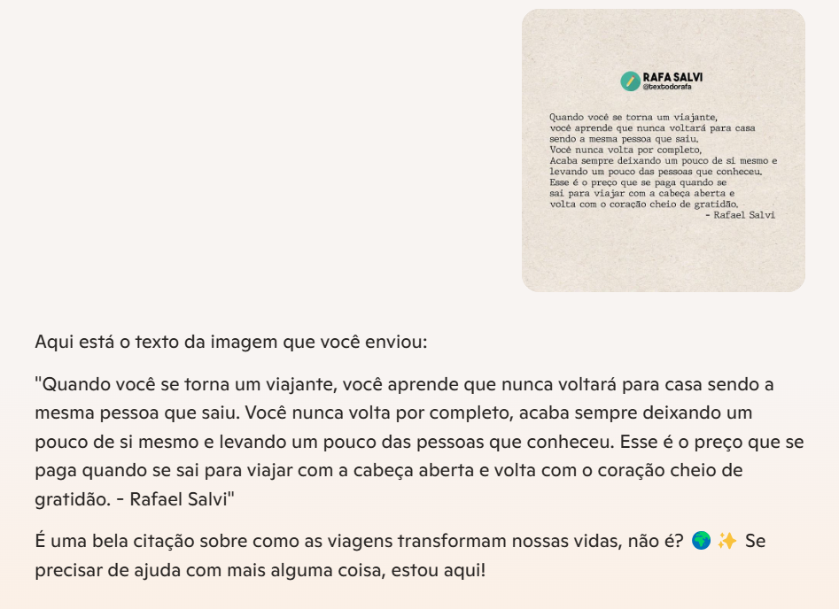
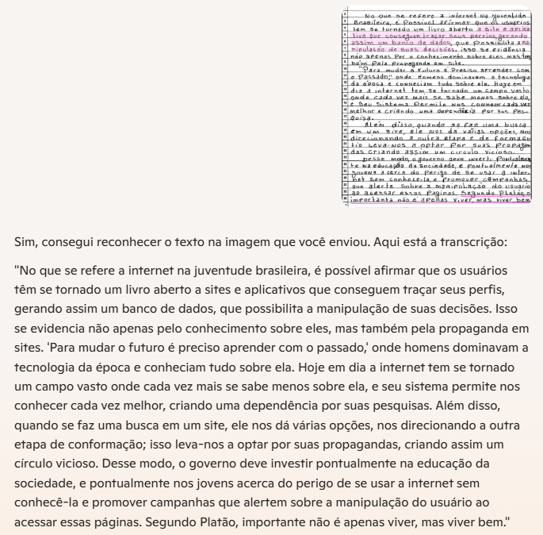

# Projeto Explorando os Recursos de IA Generativa com Copilot e OpenAI

## Análise das Imagens

### Primeira imagem

`Resultado:`
O reconhecimento de texto foi realizado com precisão, identificando corretamente o conteúdo presente na imagem

## Segunda imagem

`Resultado:`
Apesar do texto ser mais extenso e possuir uma fonte diferente, a ferramenta conseguiu capturar a informação sem dificuldades.

## Terceira imagem

`Resultado:`
Este foi o caso mais surpreendente: um texto manuscrito longo. Algumas partes não estavam completamente nítidas, mas, ainda assim, o sistema conseguiu interpretar grande parte do conteúdo, demonstrando sua robustez.

## Reflexões e descorbertas

### Precisão e Adaptabilidade

A IA mostrou-se extremamente competente em identificar textos de diferentes tamanhos e estilos, abrangendo desde fontes digitais até manuscritos. Essa flexibilidade a torna útil para diversas aplicações práticas.

### Capacidade de Superar Desafios

Fiquei impressionado com a habilidade do sistema em lidar com texto manuscrito e imagens com qualidade variável. Isso abre possibilidades para o uso em áreas como digitalização de documentos antigos e recuperação de informações.

### Aplicações Potenciais

A IA generativa pode ser aplicada em várias frentes, como:

- Educação: ajudando estudantes a digitalizar anotações;

- Empresas: automatizando a extração de informações de documentos físicos;

- Preservação Cultural: convertendo manuscritos históricos para formatos digitais.

### Eficiência e Automação

Ferramentas como essa permitem automatizar processos antes manuais e demorados, otimizando tempo e recursos. Isso evidencia o impacto positivo que a IA pode ter na forma como interagimos com informações no dia a dia.

A experiência com esses recursos mostrou como a tecnologia está evoluindo e como pode ser utilizada para aprimorar diferentes áreas da nossa vida e trabalho.
